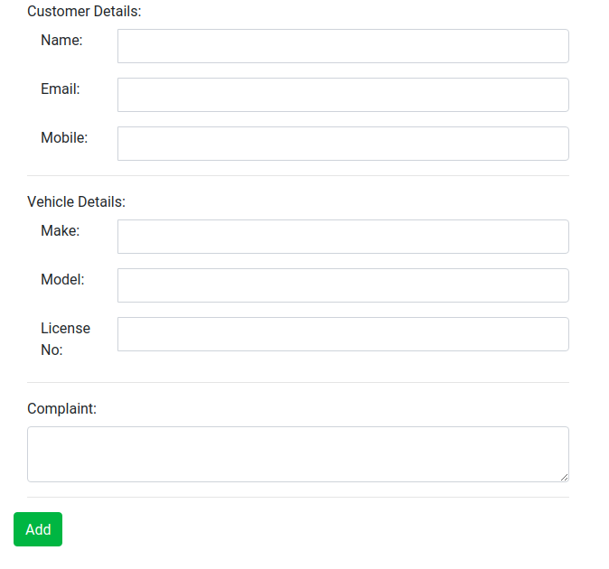
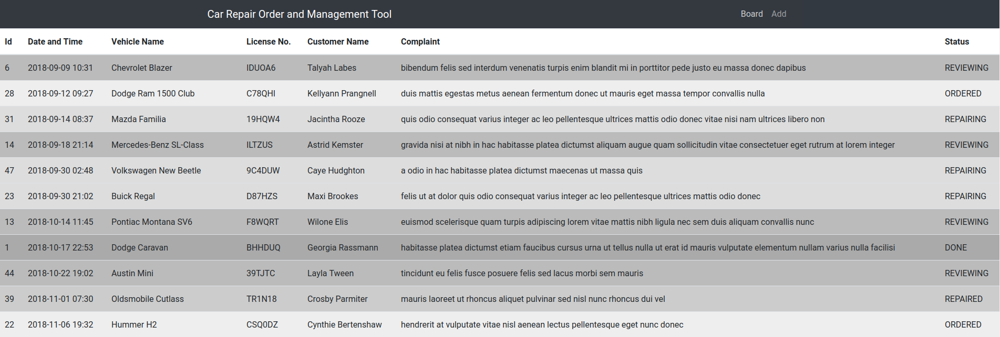
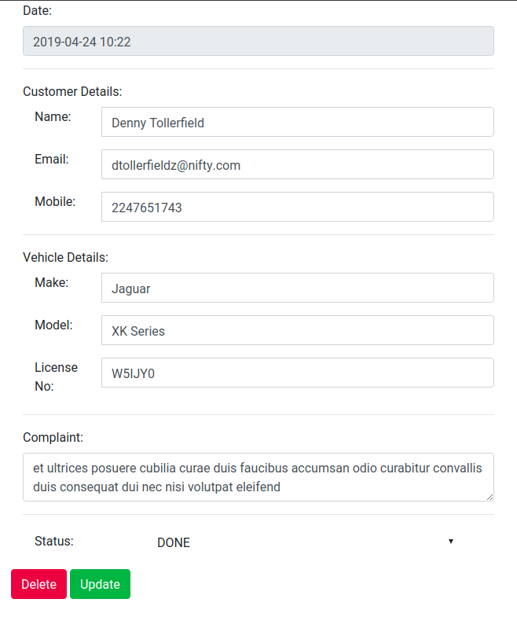
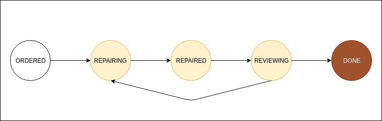

# CarRO

## Car Repair Order and Management Tool

### Create car repair orders and manage them.
<p align="center"></p>

### View list of all the Repair Orders
<p align="center"></p>

### Edit Repair Orders and update the workflow for the Repair Order
<p align="center"></p>

### Workflows included
<p align="center"></p>

### API DOCS
https://documenter.getpostman.com/view/8357128/SVfTM6RK?version=latest


### Installation and Set up
```
git clone https://github.com/compmonk/CarRO.git
cd CarRO
virtualenv -p /usr/bin/python3 venv
source venv/bin/activate
pip install -r requirements/base.txt
mongo CarRO db/createUser.js
mongorestore -d CarRO db/CarRO
python python CarRO/manage.py runserver 0.0.0.0:8000
```

### To run
```
source venv/bin/activate
python python CarRO/manage.py runserver 0.0.0.0:8000
```
